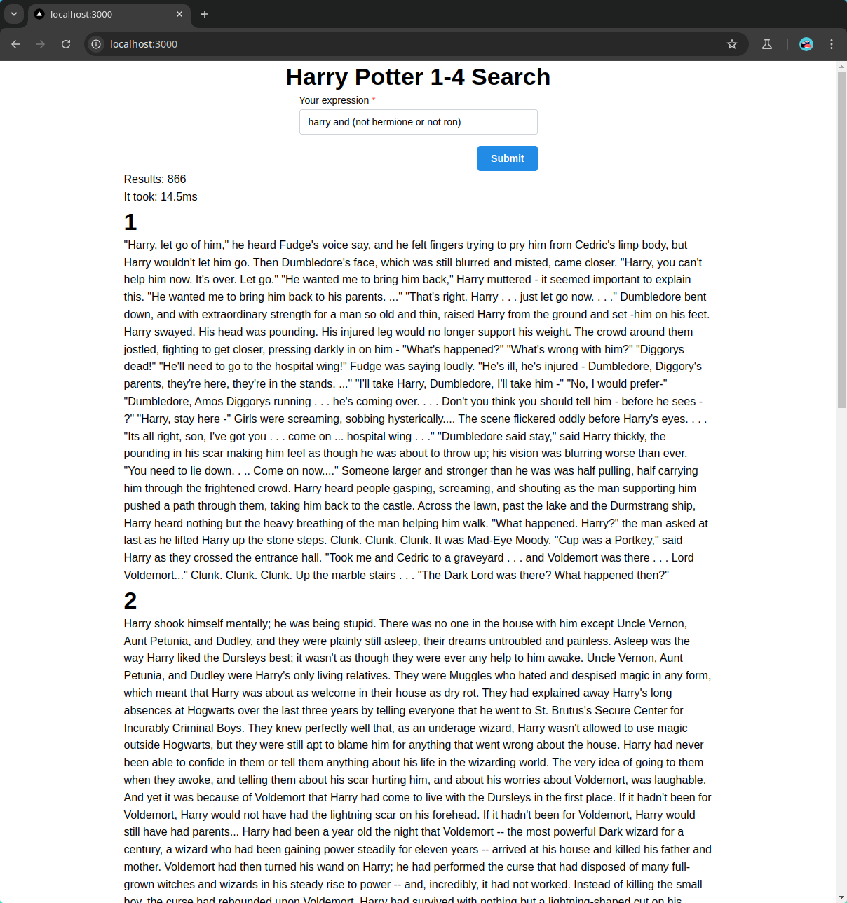

# Extended boolean model
This project implements extended boolean model for searching, in this case in PDF pages. Firstly it analyzes PDF and then it runs server which is serving requests of searches. Folder `frontend` also includes web application, that uses this server and shows results of queries.

## Instrallation
### Backend
#### Requirements
- [python-uv](https://github.com/astral-sh/uv)

#### Steps
- `uv run main.py analyze` (it expects `data/harry_potter.pdf`)
- `uv run main.py server`

### Frontend
#### Requirements
- Node.js (install from repository or use NVM or FNM)
- yarn (`npm i -g yarn`)

#### Steps
- cd to frontend folder `cd frontend`
- install dependencies `yarn install`
- run in dev mode `yarn dev`
- build production version `yarn build`
- start production version `yarn start`

## Screenshot

## Credits
This was a team project, but my dear buddy doesn't have GitHub account, so I won't be linking him.
